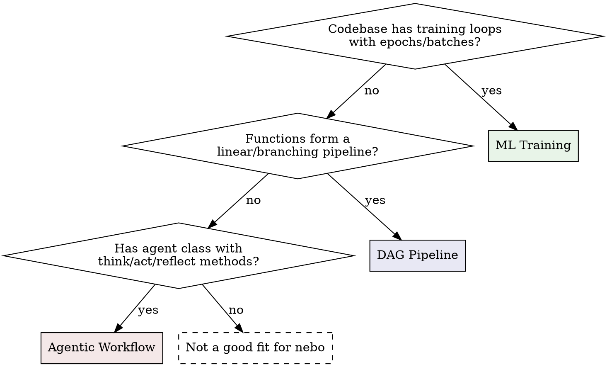

<!-- nebo-skill:instrumentation start -->
---
name: nebo-instrumentation
description: Use when writing Python code that needs to be instrumented with nebo — adding @nb.fn() decorators, calling nb.log / nb.log_line / log_bar / log_pie / log_scatter / log_histogram / log_image / log_audio / log_cfg / track, declaring run-level metadata with nb.md / nb.ui. Covers ML training loops, data-processing pipelines, and agentic workflows.
---

# Nebo (instrumentation)

## Overview

Nebo is a modern logging SDK for multi-modal data. You decorate functions with `@nb.fn()`, call `nb.log()` inside them, and nebo automatically infers a DAG from data flow, captures metrics, tracks progress, and exposes everything via MCP tools and a web UI.

**Core principle:** Decorate every meaningful step as `@nb.fn()`. Edges between nodes are inferred from data flow — no manual wiring. Call `nb.md()` and `nb.ui()` at module level before any decorated functions execute.

## Pattern Detection

Before integrating nebo, determine which pattern the codebase follows:



**Signals per pattern:**

| Signal | Pattern |
|--------|---------|
| Epoch loops, loss/accuracy, model weights, batch processing | ML Training |
| Sequential function calls, ETL, fan-out/fan-in, data transforms | DAG Pipeline |
| Class with methods like think/act/plan/reflect, agent loops, tool calls | Agentic Workflow |

## Pattern 1: ML Training / Inference

**When:** Training loops, hyperparameter sweeps, model evaluation.

```python
import nebo as nb

nb.md("Training a classifier on synthetic data.")
nb.ui(view="grid", layout="horizontal", tracker="step")

@nb.fn()
def create_dataset(n=1000):
    """Generate training data."""
    X, y = make_data(n)
    nb.log(f"Created dataset: {n} samples")
    return X, y

@nb.fn()
def train_step(model, batch_X, batch_y):
    """Single forward/backward pass."""
    loss, acc = forward_backward(model, batch_X, batch_y)
    return float(loss), float(acc)

@nb.fn()
def train(dataset, model, epochs=100, lr=0.01):
    """Main training loop."""
    nb.log_cfg({"epochs": epochs, "lr": lr})
    X, y = dataset

    for epoch in nb.track(range(epochs), name="epochs"):
        loss, acc = train_step(model, X, y)
        nb.log_line("loss", loss, step=epoch)
        nb.log_line("accuracy", acc, step=epoch)

        if epoch % 10 == 0:
            nb.log(f"Epoch {epoch}: loss={loss:.4f}")
            img = visualize(model)
            nb.log_image(img, name="weights", step=epoch)

@nb.fn()
def run_experiment():
    dataset = create_dataset()
    model = create_model()
    train(dataset, model)
```

**Key APIs for ML:**
- `nb.log_line(name, value, step=, tags=)` — loss, accuracy, lr curves; **the only chart type that accumulates over time**.
- `nb.log_bar(name, {label: number})` / `nb.log_pie(name, {label: number})` — snapshot of category counts / distribution; re-emitting overwrites.
- `nb.log_scatter(name, {label: [(x, y), ...]}, colors=False)` — labeled point clouds (e.g. embedding visualizations).
- `nb.log_histogram(name, {label: [...]}, colors=False)` — labeled distributions (e.g. weight histograms, percentile latencies).
- `colors=True` distinguishes labels by palette color (single-run); avoid in comparison views where color is reserved for run identity.
- `nb.log_image(img, step=)` — sample outputs, weight visualizations
- `nb.log_cfg(dict)` — hyperparameters shown in info tab
- `nb.track(range(epochs))` — epoch progress bar
- `view="grid"` — grid view suits metric-heavy training with many nodes
- `tracker="step"` — scrubber tracks by step count, not wall time

**Multi-run for sweeps:**
```python
for cfg in [{"lr": 0.001}, {"lr": 0.01}, {"lr": 0.1}]:
    with nb.start_run(name=f"lr={cfg['lr']}", config=cfg):
        nb.log_cfg(cfg)
        run_experiment(lr=cfg["lr"])
```

## Pattern 2: DAG-Structured Pipeline

**When:** ETL, data processing, any sequence of transforms with branching.

```python
import nebo as nb

nb.md("""
# Data Processing Pipeline
Loads data, normalizes, filters, and generates a report.
""")
nb.ui(layout="horizontal", view="dag", minimap=True, tracker="step")

@nb.fn()
def load_data(path="data.csv"):
    """Load raw records."""
    records = read_csv(path)
    nb.log(f"Loaded {len(records)} records from {path}")
    return records

@nb.fn()
def normalize(records):
    """Normalize values to [0, 1]."""
    nb.log_cfg({"method": "minmax"})
    out = [normalize_record(r) for r in nb.track(records, name="normalizing")]
    nb.log_line("record_count", float(len(out)))
    return out

@nb.fn()
def filter_outliers(records, threshold=3.0):
    """Remove statistical outliers."""
    nb.log_cfg({"threshold": threshold})
    filtered = [r for r in records if abs(r["value"]) < threshold]
    nb.log(f"Filtered: {len(records)} -> {len(filtered)}")
    return filtered

@nb.fn()
def generate_report(clean, raw):
    """Compare clean vs raw datasets."""
    nb.log(f"summary — clean: {len(clean)} | raw: {len(raw)}")
    return {"clean": len(clean), "raw": len(raw)}

@nb.fn()
def run_pipeline():
    raw = load_data()
    normed = normalize(raw)
    clean = filter_outliers(normed)
    return generate_report(clean, raw)  # fan-in: two data sources
```

**Key APIs for pipelines:**
- `nb.log_cfg(dict)` — per-step configuration in info tab
- `nb.track(items)` — progress bars on batch processing
- `nb.md(description)` — workflow-level description
- `minimap=True` — useful for wide pipelines

**DAG edges are automatic:** When `normalize(raw)` is called, nebo sees that `raw` came from `load_data()` and creates the edge `load_data -> normalize`.

## Pattern 3: Agentic Workflow

**When:** Agent class with multi-step reasoning, tool use, interactive decisions.

```python
import nebo as nb

nb.md("An agent that researches queries using think-act-reflect.")
nb.ui(view="dag", layout="vertical", tracker="step")

@nb.fn()
def fetch_context(query):
    """Retrieve relevant documents."""
    docs = search(query)
    nb.log(f"Found {len(docs)} documents")
    return docs

@nb.fn()
class Agent:
    """Multi-step reasoning agent."""

    def think(self, query, context):
        """Analyze query and form a plan."""
        nb.log(f"Thinking: {query}")
        nb.log_line("context_docs", float(len(context)))
        return {"plan": f"Respond using {len(context)} docs"}

    def act(self, plan):
        """Execute the plan."""
        nb.log(f"Acting: {plan['plan']}")
        result = execute(plan)
        return result

    def reflect(self, query, response):
        """Evaluate response quality."""
        score = evaluate(response)
        nb.log_line("quality_score", score)
        return {"score": score, "response": response}

def main():
    query = "What is nebo?"
    context = fetch_context(query)
    agent = Agent()
    plan = agent.think(query, context)
    response = agent.act(plan)
    result = agent.reflect(query, response)
```

**Key APIs for agents:**
- `@nb.fn()` on class — all methods auto-wrapped; methods appear as `Agent.think`, `Agent.act` etc. in the DAG, grouped under the class name
- `nb.log_line(name, value)` — per-action quality scores
- `view="grid"` — table view suits many small method calls
- `tracker="step"` — track by action count, not wall time

## API Quick Reference

| Function | Purpose |
|----------|---------|
| `@nb.fn()` | Register function/class as DAG node |
| `@nb.fn(depends_on=[f])` | Explicit edge when data flow can't infer |
| `@nb.fn(ui={"collapsed": True})` | Per-node UI hints |
| `nb.log(message)` | Text log to current node |
| `nb.log_line(name, value, step=, tags=)` | Scalar metric — accumulates over steps |
| `nb.log_bar(name, {label: number})` | Bar-chart snapshot — overwrites on re-emit |
| `nb.log_pie(name, {label: number})` | Pie-chart snapshot — overwrites on re-emit |
| `nb.log_scatter(name, {label: [(x, y), ...]}, colors=)` | Labeled scatter snapshot — overwrites |
| `nb.log_histogram(name, {label: [...]}, colors=)` | Labeled histogram snapshot — overwrites |
| `nb.log_cfg(dict)` | Configuration dict for info tab |
| `nb.log_image(img, name=, step=)` | PIL/numpy/torch image |
| `nb.log_audio(audio, sr=, name=, step=)` | Audio data |
| `nb.track(iterable, name=, total=)` | Progress bar |
| `nb.md(description)` | Workflow-level markdown |
| `nb.ui(layout=, view=, tracker=, ...)` | Run-level UI defaults |
| `nb.start_run(name=, config=, run_id=)` | Multi-run / resume support |
| `nb.init(mode=, dag_strategy=, ...)` | Manual initialization |

### `nb.ui()` Parameters

| Parameter | Values | Default | Notes |
|-----------|--------|---------|-------|
| `layout` | `"horizontal"`, `"vertical"` | — | DAG node flow direction |
| `view` | `"dag"`, `"grid"` | — | Default view mode |
| `tracker` | `"time"`, `"step"` | — | Timeline scrubber mode |
| `collapsed` | `bool` | — | Default node collapse |
| `minimap` | `bool` | — | Show DAG minimap |
| `theme` | `"dark"`, `"light"` | — | Color theme |

**Recommended `.ui()` per pattern:**

| Pattern | Recommended | Why |
|---------|-------------|-----|
| ML Training | `view="dag", tracker="step"` | Steps matter more than wall time for training |
| DAG Pipeline | `view="dag", minimap=True, layout="horizontal"` | Wide DAGs benefit from minimap |
| Agentic | `view="grid", tracker="step"` | Many small method calls suit table view |

### `nb.start_run()` — Multi-Run Support

Use for hyperparameter sweeps, A/B experiments, or interleaving runs:

```python
# Context manager — state isolated per run. "as run" is optional.
with nb.start_run(name="experiment-1", config={"lr": 0.01}) as run:
    print(run.run_id)   # 12-char hex
    print(run.name)     # "experiment-1"
    print(run.config)   # {"lr": 0.01}
    # ... do work. State (nodes, edges) scoped to this run.

# Without "as run" — use when you don't need the run object:
with nb.start_run(name="sweep-1", config=cfg):
    run_experiment()

# Resume a previous run
with nb.start_run(name="experiment-1", run_id=previous_run_id):
    # Restores saved state, continues where it left off
    ...
```

**`start_run(config=)` vs `nb.log_cfg()`:** `config=` sets run-level metadata (visible in run history). `nb.log_cfg()` sets per-node params (visible in the node's info tab). Use both — they serve different levels.

### DAG Edge Inference

Edges are created automatically from **data flow** — when a return value from node A is passed as an argument to node B:

```python
data = load()       # node: load
result = process(data)  # edge: load -> process (data flows between them)
save(result)        # edge: process -> save
```

If no data-flow argument exists, the edge falls back to the **calling parent**.

Use `depends_on` for implicit dependencies (shared state, globals):
```python
@nb.fn(depends_on=[setup])
def process():
    ...  # uses resources from setup() via shared state
```

## MCP Tools Reference

When the nebo daemon is running (`nebo serve`), 15 MCP tools are available for querying and controlling pipelines. Run `nebo mcp` to get the Claude Code MCP config.

### Observation — Reading Logs and State

| Tool | Parameters | Returns |
|------|------------|---------|
| `nebo_get_graph` | `run_id?` | Full DAG: nodes (name, docstring, exec_count, progress, group, ui_hints), edges, workflow description |
| `nebo_get_loggable_status` | `loggable_id`, `run_id?` | Single loggable detail (node or global): logs (last 20), metrics, errors, params, progress |
| `nebo_get_logs` | `loggable_id?`, `run_id?`, `limit?` (default 100) | Recent log entries filtered by loggable_id |
| `nebo_get_metrics` | `loggable_id`, `name?` | Metric time series: `{metric_name: [(step, value), ...]}` |
| `nebo_get_errors` | `run_id?` | All errors with full tracebacks, node context, params |
| `nebo_get_description` | — | Workflow description + all node docstrings |
| `nebo_get_run_status` | `run_id` | Run status: running/completed/crashed/stopped, exit code, duration |
| `nebo_get_run_history` | — | All runs with outcomes, timestamps, error counts |

### Utility & Write

| Tool | Parameters | Returns |
|------|------------|---------|
| `nebo_wait_for_alert` | `run_id`, `timeout?` (300), `min_level?` (20) | Block until `nb.alert(...)` fires at or above min_level |
| `nebo_load_file` | `filepath` | Load a `.nebo` file into the daemon |
| `nebo_log_metric` / `_text` / `_image` / `_audio` | `entries`, `run_id?` | Push entries; default `loggable_id` is `__agent__` |

### Typical Workflow

1. The user launches the script themselves: `uv run python my_script.py`. The SDK prints `Your run id is: <id>.` on connect.
2. **Watch:** `nebo_wait_for_alert` to block until `nb.alert(...)` fires (or use the equivalent CLI: `nebo runs wait <id>`).
3. **Inspect:** `nebo_get_graph` for DAG overview, `nebo_get_logs` / `nebo_get_metrics` for detail.
4. **Debug:** `nebo_get_errors` for tracebacks with full node context.
5. **Iterate:** Edit the source file directly with your normal file tools, then re-run from the shell.

## Common Mistakes

| Mistake | Fix |
|---------|-----|
| Calling `nb.log()` outside `@nb.fn()` | All logging must be inside a decorated function |
| Manual DAG wiring | Let data flow infer edges. Only use `depends_on` for implicit deps |
| Forgetting `step=` in training metrics | Without step, metrics pile up without x-axis alignment |
| Calling `nb.ui()` inside `@nb.fn()` | Call `nb.ui()` at module level, before any function runs |
| Not using `nb.md()` | Always set a workflow description — it appears in MCP tools and the UI |
| Using `nb.init()` unnecessarily | Nebo auto-detects mode. Only call `init()` to override defaults |
| Decorating `__init__` explicitly | `@nb.fn()` on a class already wraps all methods |
| Logging inside tight inner loops | Log metrics per-epoch, not per-sample. Use `nb.track()` for progress |
<!-- nebo-skill:instrumentation end -->

<!-- nebo-skill:runs-qa start -->
---
name: nebo-runs-qa
description: Use when the user asks questions about nebo runs — logs, metrics, errors, DAG structure, comparisons across runs — or wants you to compute and display a derived metric (line, bar, pie, scatter, histogram) in the nebo web UI. Talks to the daemon via the `nebo` CLI (no MCP configuration required). The daemon must be running (`nebo serve`).
---

# Nebo Q&A and derived metrics (CLI)

Answer questions about nebo runs by spawning `nebo` CLI subprocesses with
`--json`. Optionally compute derived metrics and push them back into the
nebo UI via the same CLI.

## Precondition

The nebo daemon must be running:

    nebo serve            # foreground
    nebo serve --daemon   # background

The `nebo` CLI must be on `$PATH`. No MCP configuration required.

If the user asks about a finished run not loaded into the daemon, suggest:

    nebo load <path-to-.nebo>

## Finding the run id

When the user runs a script, the SDK prints a banner to their terminal:

    Nebo daemon fully connected. Your run id is: abc123def456.

Use that 12-character hex id in every subsequent command. If the user
hasn't shared their terminal output:

    nebo runs list --json

and pick the most recent.

## Q&A playbook (single run)

Always pass `--json`. Pipe the output into your reasoning step — don't
rely on the human-formatted columns.

| Intent | Command |
|---|---|
| What runs exist? | `nebo runs list --json` |
| Summarize run R | `nebo runs show <R> --json` |
| What does the workflow do? | `nebo describe --run <R> --json` |
| Inspect the DAG | `nebo graph show --run <R> --json` |
| What did node N do? | `nebo loggables show <N> --run <R> --json` |
| Get logs for node N | `nebo logs --run <R> --node <N> --json` |
| Get errors | `nebo errors --run <R> --json` |
| List available metrics | `nebo metrics list --run <R> --json` |
| Read metric values | `nebo metrics get <loggable> --name <M> --run <R> --json` |
| Filter a metric by tag | append `--tag <T>` |
| Filter a metric by step | append `--step <S>` |
| Wait for an alert | `nebo runs wait <R> --timeout 300 --min-level 20 --json` |

`nebo runs wait` blocks until `nb.alert(...)` fires in the pipeline at a
level at or above `--min-level`, or the `--timeout` elapses.

## Drawing a derived metric

When the answer is better as a chart, compute the values and write them
to the `__agent__` sandbox loggable:

    nebo metrics log --run <R> --entries-json '[{"name":"loss_ma_10","type":"line","value":0.412,"step":10}]'

Value shapes per chart type:

- `line` (accumulating): `value` is a number. `step` aligns the x-axis.
- `bar` (snapshot): `value` is `{"label": number}`; re-emit overwrites.
- `pie` (snapshot): `value` is `{"label": number}`; re-emit overwrites.
- `scatter` (accumulating): `value` is `{"label": {"x": [...], "y": [...]}}`.
- `histogram` (snapshot): `value` is `{"label": [number, ...]}`.

`loggable_id` defaults to `__agent__` when omitted — the right home for
derived work. Use a distinct `name` (e.g. `derived_<intent>`) to avoid
colliding with user-emitted metrics.

### Adding to an existing chart vs. making a new one

Each `(loggable_id, name)` pair is one chart. The **chart type** locks
on first emission for that pair — once a series is created as `scatter`
you can't later re-emit it as `bar`. The **data and labels do not lock**:

- `line` and `scatter` *accumulate*. Re-emitting the same
  `(loggable_id, name)` with a new value (and, for scatter, new labels)
  adds points/series to the existing chart. Old data stays.
- `bar`, `pie`, `histogram` are *snapshots*. Re-emitting overwrites the
  prior value — the chart now shows only the new data.

So to overlay agent-computed points onto a user's existing scatter chart,
emit with the user's exact `loggable_id` and `name` (and `type:"scatter"`).
To keep agent output separated, emit to `__agent__` (the default) under a
new `name`.

## Images and audio

You can emit images or audio with three input shapes:

| Field | Where the bytes are |
|---|---|
| `path: "/abs/path.png"` | On disk; the CLI reads and base64-encodes |
| `url: "https://..."` | Remote; the daemon fetches and stores |
| `data: "<base64>"` | Already base64 |

Exactly one of `path` / `url` / `data` per entry. Examples:

    nebo images log --run <R> --entries-json '[{"name":"plot","path":"/tmp/plot.png"}]'
    nebo audio log  --run <R> --entries-json '[{"name":"snd","path":"/tmp/snd.wav","sr":22050}]'

`path` is the most natural form when you've just generated the file
yourself (e.g. matplotlib `savefig` to a tmp file).

## Multi-run Q&A

There is no cross-run query. Loop:

1. `nebo runs list --json` — pick the relevant run ids.
2. For each: `nebo runs show <id> --json` (for `metrics_index`) then
   `nebo metrics get <loggable> --name <M> --run <id> --json` for the
   metrics of interest.
3. Reason across the responses in your reply.

Token discipline: prefer `metrics_index` from `runs show` over fetching
every loggable's metrics blindly.

### Visualizing a cross-run answer

Comparison views in the nebo web UI are pure UI state — the daemon
doesn't know which runs the user has selected, and you can't push the
UI into a particular comparison. But you have two ways to make a
cross-run answer *visual*:

**A. Seed an overlay the user can open themselves.** Emit the same
metric `name` to the same `loggable_id` on each run you want compared.
Example: after looping the runs you want to compare, write a
`derived_loss` line metric to `__agent__` on each:

    nebo metrics log --run R1 --entries-json '[{"name":"derived_loss","type":"line","value":0.41,"step":0}]'
    nebo metrics log --run R2 --entries-json '[{"name":"derived_loss","type":"line","value":0.38,"step":0}]'
    nebo metrics log --run R3 --entries-json '[{"name":"derived_loss","type":"line","value":0.45,"step":0}]'

Tell the user: "Open the comparison view, select R1/R2/R3, and look at
`__agent__ ▸ derived_loss`." The UI overlays the three series — same
loggable_id + name across selected runs is the comparison contract.

**B. Synthesize the comparison into a single chart on one run.** When
you don't need the user to do anything in the UI, fold the multi-run
result into a single chart on one chosen run. A bar chart keyed by run
name is the most common form:

    nebo metrics log --run R1 --entries-json '[{
      "name": "final_loss_by_run",
      "type": "bar",
      "value": {"R1": 0.41, "R2": 0.38, "R3": 0.45}
    }]'

That single bar chart on `__agent__` answers the cross-run question
without requiring the user to open the comparison view at all. Useful
when the comparison itself is the deliverable rather than a starting
point for further exploration.

## Anti-patterns

- Don't omit `--json`. Human columns drift and break parsers.
- Don't write to `__global__` — that's the user's space. Default
  `loggable_id` `__agent__` is correct for derived work.
- Don't try to declare new chart types — only line/bar/pie/scatter/histogram.
- Don't try to start/stop pipelines from the skill. That's the user's
  shell (`uv run python script.py`, Ctrl+C, `pkill`).

## Connection settings

Every read/write subcommand accepts:

- `--url <url>` — daemon URL (defaults to `NEBO_CLI_URL` env or `http://localhost:7861`).
- `--port <N>` — daemon port if the daemon isn't at the default.
- `--api-token <token>` — required if the daemon was started with
  `nebo serve --api-token <X>` and read access is gated.

You can also set `NEBO_CLI_URL`, `NEBO_CLI_PORT`, `NEBO_API_TOKEN` environment
variables once instead of passing flags every call.

## Optional: MCP

If the user already has the nebo MCP server configured, the same tools
are available without spawning subprocesses. Both transports are parallel
— pick one based on the user's setup.

| CLI | MCP tool |
|---|---|
| `nebo runs list` | `nebo_get_run_history` |
| `nebo runs show <R>` | `nebo_get_run_status` |
| `nebo describe` | `nebo_get_description` |
| `nebo graph show` | `nebo_get_graph` |
| `nebo loggables show <id>` | `nebo_get_loggable_status` |
| `nebo logs` | `nebo_get_logs` |
| `nebo errors` | `nebo_get_errors` |
| `nebo metrics get` | `nebo_get_metrics` |
| `nebo metrics log` | `nebo_log_metric` |
| `nebo text log` | `nebo_log_text` |
| `nebo images log` | `nebo_log_image` |
| `nebo audio log` | `nebo_log_audio` |
| `nebo runs wait` | `nebo_wait_for_alert` |
| `nebo load` | `nebo_load_file` |
<!-- nebo-skill:runs-qa end -->
