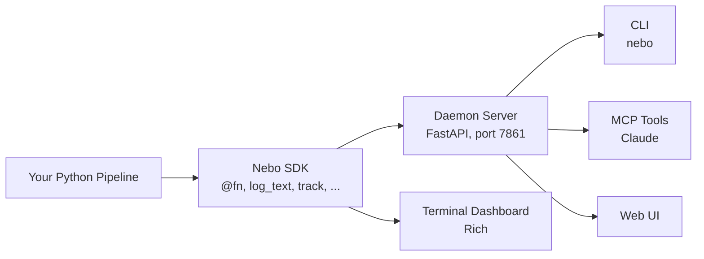

# Nebo

[](https://pypi.org/project/nebo/)
[](https://pypi.org/project/nebo/)
[](https://github.com/graphbookai/nebo/actions/workflows/ci.yml)
[](LICENSE)


Nebo is a modern logging SDK that lets you track experiments containing multi-modal data (text, images, audio) and inspect metrics with function-level granularity.

```bash
pip install nebo
```

Get started: https://docs.graphbook.ai/nebo

## Why Nebo?

Nebo offers a wide range of logging capabilities for data processing applications.

* You can log metrics, images, audio, and text
* Every log event can be tracked at specified time ranges or steps
* Nebo offers function-level capturing data at the granularity of individual functions, so you can monitor inputs, outputs, and execution flow of your code.

These features enable observability for applications such as:

* DAG-structured data-processing pipelines
* Model chaining applications
* ML training

Following the Tensorboard model, Nebo is local-first, so you don’t need to start another separate service, or worse, create an account to log data. Each run is stored in one .nebo file, a self-contained file format for simplicity, so that managing them is easy. When you're ready, you can deploy Nebo as a remote service, visit the web UI from your mobile device, and watch live metrics away from your desk since the UI is mobile-friendly.

Agent skills are released in the package preparing coding agents to not only write nebo-integrated code but also to monitor, analyze, and deliver derived metrics directly to the UI. This allows the full development lifecycle to progress inside the user's favorite coding agent application.

### Features

* Captured log types: text, metrics, images, audio, progress
* Automatically infers a DAG from your call graph
* CLI, MCP and agent skill for AI agent query support
* MCP write tools so external agents can push metrics, images, audio, and text into a run
* Fully self-contained log file per run
* Mobile-first web UI
* Notebook embedding via `nb.show()` (Jupyter-renderable iframe of any slice of a run)
* One-command deploy to a Hugging Face Space (`nebo deploy`) with public/private read+write modes
* Organize runs into a tree with groups

## Architecture



Two execution modes:

- **Local mode** (default): In-process only. No daemon needed.
- **Server mode**: Events stream to a persistent daemon via HTTP. Use `nebo serve` to start the daemon.

The daemon can run on your laptop, in CI, or on a Hugging Face Space (`nebo deploy`). The same SDK code works against any of them — set `NEBO_URL` and `NEBO_API_TOKEN` to point at the target. When the daemon enforces auth, every API request must carry the token via the `X-Nebo-Token` header (HTTP) or the `?token=…` query param (browsers / WebSocket).
