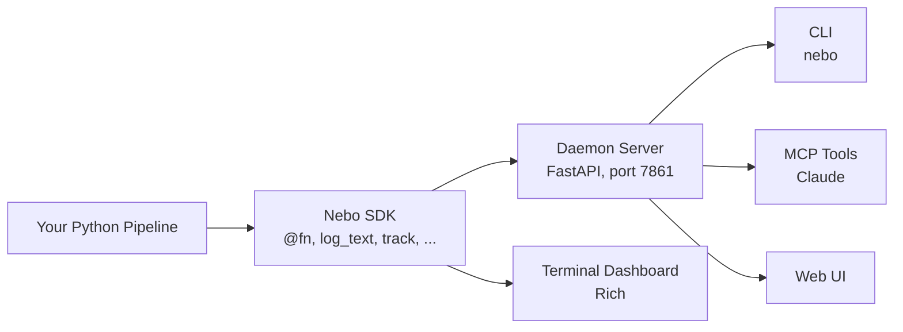

<div align="center">


<h1>Nebo</h1>

<p><strong>AI agents and humans are welcome here.</strong></p>

<p>A modern, local-first logging SDK for multi-modal experiment data built for humans and AI agents.</p>

<p><code>pip install nebo</code></p>

<p>
  <a href="https://pypi.org/project/nebo/"></a>
  <a href="https://pypi.org/project/nebo/"></a>
  <a href="https://github.com/graphbookai/nebo/actions/workflows/ci.yml"></a>
  <a href="https://github.com/graphbookai/nebo/blob/main/LICENSE"></a>
  
</p>

<p>
  <a href="https://docs.graphbook.ai/nebo"><b>Documentation</b></a>
  &nbsp;·&nbsp;
  <a href="https://github.com/graphbookai/nebo/tree/main/examples"><b>Examples</b></a>
  &nbsp;·&nbsp;
  <a href="https://github.com/graphbookai/nebo/issues"><b>Issues</b></a>
</p>

</div>


## Why Nebo?

Nebo is a **lightweight, multi-modal** logging tool designed for humans and AI agents. Nebo agent skills are released with every version and can be installed with

```bash
nebo skills install
```

allowing coding agents to understand the SDK, monitor the logs, and author its own logs. Nebo allows for fully autonomous experiments with your favorite coding agent.

Nebo is also **local-first**, so you don’t need to start another separate service, or worse, create an account to log data. Each run is simply stored in one .nebo file and can be managed into a tree of groups.

You can also deploy Nebo as a remote service, visit the web UI from your mobile device, and watch live metrics away from your desk since the UI is **mobile-friendly**.

Nebo offers **function-level logging** capturing data at the granularity of individual functions, so you can monitor inputs, outputs, and execution flow of your code.

These features enable observability and the autonomous development of such applications types:

* ML training
* DAG-structured data-processing pipelines
* Model chaining applications

## Features

* Local-first and free, cloud/remote-hosting optional
* Mobile-first web UI
* AI-native integration with fully interoperable CLI, agent skills, and MCP
* Captured log types: text, metrics, images, audio, md, progress
* Data scrubbing between time/steps
* Function-level logging that automatically infers a DAG from your call graph
* HTML embedding with iframes of many UI components: runs, DAG nodes, charts, media
* Notebook embedding via `nb.show()` delivering a Jupyter-friendly iframe of any slice of a run
* One-command deploy to a Hugging Face Space via `nebo deploy` with public/private modes
* Automatically organize runs into a tree with groups
* One easily managable append-only file per run
* SQLite caching for fast queries and memory budget


## Installation
It's recommended to install nebo with [uv](https://docs.astral.sh/uv/getting-started/installation/):
```bash
uv pip install nebo
```
And *highly* recommended to install the agent skills released in each version:
```bash
uv run nebo skills install
```

## Usage


#### A simple hello world program:

```python
import nebo as nb

nb.log_text("greeting", "Hello world!")
```


#### Track your training experiment:

```python
import torch
import nebo as nb

nb.start_run(name="v1", group="mnist/classify")  # run v1 in group mnist/classify
Y = torch.randn(100, 4)
for batch in nb.track(Y):  # progress tracking
    loss = torch.rand(())
    acc = torch.rand(())

    nb.log_line("loss", loss)  # tensors accepted directly
    nb.log_line("acc", acc)
```


### Start the Daemon and View the UI

By default, runs land in `./.nebo/` as a single append-only file. To watch it live (or browse it later), start the daemon and open the web UI:

```bash
nebo serve
```

And navigate to http://localhost:7861.


### Data Pipelines and DAGs
Decorate the functions you care about and log from anywhere — no `nb.init()`, no account, no service to stand up first:

```python
import nebo as nb

@nb.fn()
def prepare():
    nb.log_text("status", "loaded 3 items")
    return [1, 2, 3]

@nb.fn()
def train(data):
    for x in data:
        nb.log_line("loss", 1.0 / x)
    return "model"

train(prepare())
```

The DAG view shows `prepare → train` inferred from the call graph with each function's text, metrics, images, and audio attached to its node.


## Deploy to Hugging Face Spaces

> [!WARNING]
> Hugging Face recently restricted Docker spaces from being free, so now, deploying nebo to HF Spaces requires a PRO account.

Nebo offers a native integration with Hugging Face spaces, which is a great way to share your logs or watch your experiments, remotely on a mobile device.

```bash
pip install nebo[deploy]
nebo deploy --space-id <owner>/<name>
```

One command creates (or updates) the Space, uploads the daemon image, sets a generated `NEBO_API_TOKEN` as a Space secret, and waits for the build to report healthy. By default the UI is publicly viewable while writes require the token. You can configure visibility with `--read public|private` and `--write public|private`, or hide the entire Space with `--private`.

The deploy prints everything needed to connect, including the API token. Set those as environment variables:

```bash
export NEBO_URI=https://<owner>-<name>.hf.space    # SDK: runs stream to the Space
export NEBO_API_TOKEN=nb_...                       # required for writes
export NEBO_URL=https://<owner>-<name>.hf.space    # points the nebo CLI / MCP at it
```

Or connect with the SDK:

```python
import nebo as nb

nb.init(uri="https://<owner>-<name>.hf.space", api_token="nb_...")
```

#### Then, embed your logs with iframes

In addition to viewing your logs at `https://<owner>-<name>.hf.space`, you can embed certain UI components into any web page:

```html
<iframe src="https://<owner>-<name>.hf.space/?run=<run_id>&metric=loss" width="100%" height="500"></iframe>
```

The slice is inferred from the query params — every embeddable component and its URL format:

| Embed | URL format |
|---|---|
| Full run dashboard | `?run=<run_id>` |
| DAG only | `?run=<run_id>&dag` |
| Flat card grid | `?run=<run_id>&flat` |
| Single function (node) card | `?run=<run_id>&node=<function>` |
| Text panel (all streams) | `?run=<run_id>&text` |
| One text stream | `?run=<run_id>&text=<name>` |
| Metrics gallery | `?run=<run_id>&metrics` |
| One metric chart | `?run=<run_id>&metric=<name>` |
| Image gallery | `?run=<run_id>&images` |
| One image stream | `?run=<run_id>&image=<name>` |
| Audio gallery | `?run=<run_id>&audios` |
| One audio stream | `?run=<run_id>&audio=<name>` |
| Canonical reference (run) | `?ref=nebo://run/<run_id>` |
| Canonical reference (node / stream) | `?ref=nebo://run/<run_id>/<loggable>[/<stream>]` |

Modifiers, composable with any row:

* `&node=<function>` — filter a panel/gallery slice to one function (accepts the loggable id or the bare function name).
* `&token=<token>` — authenticate against a token-protected daemon; the UI captures it once into localStorage and strips it from the visible URL.
* Phone-width iframes automatically render the mobile layout.


## Architecture



Two execution modes:

- **Local mode** (default): In-process only. No daemon needed.
- **Server mode**: Events stream to a persistent daemon via HTTP. Use `nebo serve` to start the daemon.

The daemon can run on your laptop, in CI, or on a Hugging Face Space (`nebo deploy`). The same SDK code works against any of them — set `NEBO_URL` and `NEBO_API_TOKEN` to point at the target. When the daemon enforces auth, every API request must carry the token via the `X-Nebo-Token` header (HTTP) or the `?token=…` query param (browsers / WebSocket).
