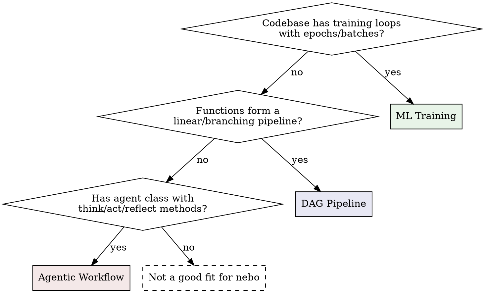

# Nebo (instrumentation)

## Overview

Nebo is a modern logging SDK for experiment tracking and visualizing data pipelines, supporting multi-modal data. Nebo captures metrics and media, tracks progress, and exposes everything via CLI, MCP tools and a web UI.

**Core principle:** Decorate every meaningful step as `@nb.fn()`. Edges between nodes are inferred from data flow — no manual wiring. Call `nb.md()` and `nb.ui()` at module level before any decorated functions execute — they are declarative (no run is created until the first real log/metric event) and compose with `nb.start_run()`: metadata declared outside a run applies to every run the script opens; metadata called inside a run applies to that run only.

## Pattern Detection

Before integrating nebo, determine which pattern the codebase follows:



**Signals per pattern:**

| Signal | Pattern |
|--------|---------|
| Epoch loops, loss/accuracy, model weights, batch processing | ML Training |
| Sequential function calls, ETL, fan-out/fan-in, data transforms | DAG Pipeline |
| Class with methods like think/act/plan/reflect, agent loops, tool calls | Agentic Workflow |

## Pattern 1: ML Training / Inference

**When:** Training loops, hyperparameter sweeps, model evaluation.

```python
import nebo as nb

nb.md("Training a classifier on synthetic data.")
nb.ui(view="flat", layout="horizontal", tracker="step")

@nb.fn()
def create_dataset(n=1000):
    """Generate training data."""
    X, y = make_data(n)
    nb.log_text("status", f"Created dataset: {n} samples")
    return X, y

@nb.fn()
def train_step(model, batch_X, batch_y):
    """Single forward/backward pass."""
    loss, acc = forward_backward(model, batch_X, batch_y)
    return float(loss), float(acc)

@nb.fn()
def train(dataset, model, epochs=100, lr=0.01):
    """Main training loop."""
    nb.log_cfg({"epochs": epochs, "lr": lr})
    X, y = dataset

    for epoch in nb.track(range(epochs), name="epochs"):
        loss, acc = train_step(model, X, y)
        nb.log_line("loss", loss, step=epoch)
        nb.log_line("accuracy", acc, step=epoch)

        if epoch % 10 == 0:
            nb.log_text("epochs", f"Epoch {epoch}: loss={loss:.4f}")
            img = visualize(model)
            nb.log_image(img, name="weights", step=epoch)

def run_experiment():
    dataset = create_dataset()
    model = create_model()
    train(dataset, model)
```

**Key APIs for ML:**
- `nb.log_line(name, value, step=, tags=)` — loss, accuracy, lr curves; **the only chart type that accumulates over time**.
- `nb.log_bar(name, {label: number})` / `nb.log_pie(name, {label: number})` — snapshot of category counts / distribution; re-emitting overwrites.
- `nb.log_scatter(name, {label: [(x, y), ...]}, colors=False)` — labeled point clouds (e.g. embedding visualizations).
- `nb.log_histogram(name, {label: [...]}, colors=False)` — labeled distributions (e.g. weight histograms, percentile latencies).
- `colors=True` distinguishes labels by palette color (single-run); avoid in comparison views where color is reserved for run identity.
- `nb.log_image(img, step=)` — sample outputs, weight visualizations
- `nb.log_cfg(dict)` — hyperparameters shown in info tab
- `nb.track(range(epochs))` — epoch progress bar
- `view="flat"` — flat view suits metric-heavy training with many nodes
- `tracker="step"` — scrubber tracks by step count, not wall time

**Multi-run for sweeps:**
```python
for cfg in [{"lr": 0.001}, {"lr": 0.01}, {"lr": 0.1}]:
    with nb.start_run(name=f"lr={cfg['lr']}", config=cfg):
        nb.log_cfg(cfg)
        run_experiment(lr=cfg["lr"])
```

## Pattern 2: DAG-Structured Pipeline

**When:** ETL, data processing, any sequence of transforms with branching.

You decorate functions with `@nb.fn()`, call `nb.log_*` inside them, and nebo automatically infers a DAG from data flow

```python
import nebo as nb

nb.md("""
# Data Processing Pipeline
Loads data, normalizes, filters, and generates a report.
""")
nb.ui(layout="horizontal", view="dag", minimap=True, tracker="step")

@nb.fn()
def load_data(path="data.csv"):
    """Load raw records."""
    records = read_csv(path)
    nb.log_text("status", f"Loaded {len(records)} records from {path}")
    return records

@nb.fn()
def normalize(records):
    """Normalize values to [0, 1]."""
    nb.log_cfg({"method": "minmax"})
    out = [normalize_record(r) for r in nb.track(records, name="normalizing")]
    nb.log_line("record_count", float(len(out)))
    return out

@nb.fn()
def filter_outliers(records, threshold=3.0):
    """Remove statistical outliers."""
    nb.log_cfg({"threshold": threshold})
    filtered = [r for r in records if abs(r["value"]) < threshold]
    nb.log_text("status", f"Filtered: {len(records)} -> {len(filtered)}")
    return filtered

@nb.fn()
def generate_report(clean, raw):
    """Compare clean vs raw datasets."""
    nb.log_text("summary", f"summary — clean: {len(clean)} | raw: {len(raw)}")
    return {"clean": len(clean), "raw": len(raw)}

def run_pipeline():
    raw = load_data()
    normed = normalize(raw)
    clean = filter_outliers(normed)
    return generate_report(clean, raw)  # fan-in: two data sources
```

**Key APIs for pipelines:**
- `nb.log_cfg(dict)` — per-step configuration in info tab
- `nb.track(items)` — progress bars on batch processing
- `nb.md(description)` — workflow-level description
- `minimap=True` — useful for wide pipelines

**DAG edges are automatic:** When `normalize(raw)` is called, nebo sees that `raw` came from `load_data()` and creates the edge `load_data -> normalize`.

## Pattern 3: Agentic Workflow

**When:** Agent class with multi-step reasoning, tool use, interactive decisions.

```python
import nebo as nb

nb.md("An agent that researches queries using think-act-reflect.")
nb.ui(view="dag", layout="vertical", tracker="step")

@nb.fn()
def fetch_context(query):
    """Retrieve relevant documents."""
    docs = search(query)
    nb.log_text("status", f"Found {len(docs)} documents")
    return docs

@nb.fn()
class Agent:
    """Multi-step reasoning agent."""

    def think(self, query, context):
        """Analyze query and form a plan."""
        nb.log_text("thoughts", f"Thinking: {query}")
        nb.log_line("context_docs", float(len(context)))
        return {"plan": f"Respond using {len(context)} docs"}

    def act(self, plan):
        """Execute the plan."""
        nb.log_text("actions", f"Acting: {plan['plan']}")
        result = execute(plan)
        return result

    def reflect(self, query, response):
        """Evaluate response quality."""
        score = evaluate(response)
        nb.log_line("quality_score", score)
        return {"score": score, "response": response}

def main():
    query = "What is nebo?"
    context = fetch_context(query)
    agent = Agent()
    plan = agent.think(query, context)
    response = agent.act(plan)
    result = agent.reflect(query, response)
```

**Key APIs for agents:**
- `@nb.fn()` on class — all methods auto-wrapped; methods appear as `Agent.think`, `Agent.act` etc. in the DAG, grouped under the class name
- `nb.log_line(name, value)` — per-action quality scores
- `view="flat"` — flat view suits many small method calls
- `tracker="step"` — track by action count, not wall time

## API Quick Reference

| Function | Purpose |
|----------|---------|
| `@nb.fn()` | Register function/class as DAG node |
| `@nb.fn(depends_on=[f])` | Explicit edge when data flow can't infer |
| `@nb.fn(ui={"collapsed": True})` | Per-node UI hints |
| `nb.log_text(name, message, step=)` | Named text stream on the current node |
| `nb.log_line(name, value, step=, tags=)` | Scalar metric — accumulates over steps |
| `nb.log_bar(name, {label: number})` | Bar-chart snapshot — overwrites on re-emit |
| `nb.log_pie(name, {label: number})` | Pie-chart snapshot — overwrites on re-emit |
| `nb.log_scatter(name, {label: [(x, y), ...]}, colors=)` | Labeled scatter snapshot — overwrites |
| `nb.log_histogram(name, {label: [...]}, colors=)` | Labeled histogram snapshot — overwrites |
| `nb.log_cfg(dict)` | Configuration dict for info tab |
| `nb.log_image(img, name=, step=)` | PIL/numpy/torch image |
| `nb.log_audio(audio, sr=, name=, step=)` | Audio data |
| `nb.log_body_model(name, mjcf=|urdf=)` | Publish a robot/scene once → `BodyModelRef` (needs `nebo[robotics]`) |
| `nb.log_body_transform(name, ref, pos_quat_xyzw, step=)` | One 3D frame: per-body world poses |
| `nb.track(iterable, name=, total=)` | Progress bar |
| `nb.md(description)` | Workflow-level markdown |
| `nb.ui(layout=, view=, tracker=, ...)` | Run-level UI defaults |
| `nb.start_run(name=, config=, run_id=)` | Multi-run / resume support |
| `nb.init(uri=, dag_strategy=, ...)` | Manual initialization |

### `nb.ui()` Parameters

| Parameter | Values | Default | Notes |
|-----------|--------|---------|-------|
| `layout` | `"horizontal"`, `"vertical"` | — | DAG node flow direction |
| `view` | `"dag"`, `"flat"` | — | Default view mode |
| `tracker` | `"time"`, `"step"` | — | Timeline scrubber mode |
| `collapsed` | `bool` | — | Default node collapse |
| `minimap` | `bool` | — | Show DAG minimap |
| `theme` | `"dark"`, `"light"` | — | Color theme |

**Recommended `.ui()` per pattern:**

| Pattern | Recommended | Why |
|---------|-------------|-----|
| ML Training | `view="dag", tracker="step"` | Steps matter more than wall time for training |
| DAG Pipeline | `view="dag", minimap=True, layout="horizontal"` | Wide DAGs benefit from minimap |
| Agentic | `view="flat", tracker="step"` | Many small method calls suit flat view |

### `nb.start_run()` — Multi-Run Support

Use for hyperparameter sweeps, A/B experiments, or interleaving runs:

```python
# Context manager — state isolated per run. "as run" is optional.
with nb.start_run(name="experiment-1", config={"lr": 0.01}) as run:
    print(run.run_id)   # 12-char hex
    print(run.name)     # "experiment-1"
    print(run.config)   # {"lr": 0.01}
    # ... do work. State (nodes, edges) scoped to this run.

# Without "as run" — use when you don't need the run object:
with nb.start_run(name="sweep-1", config=cfg):
    run_experiment()

# Resume a previous run
with nb.start_run(name="experiment-1", run_id=previous_run_id):
    # Restores saved state, continues where it left off
    ...
```

**`start_run(config=)` vs `nb.log_cfg()`:** `config=` sets run-level metadata (visible in run history). `nb.log_cfg()` sets per-node params (visible in the node's info tab). Use both — they serve different levels.

### Organizing runs into groups (`group=` / `NEBO_GROUP`)

Place a run in a filesystem-like group so it's organized in the UI/CLI tree:

```python
nb.init(group="vision/detr")                 # default group for the process
with nb.start_run(name="lr=3e-4", group="vision/detr/lr-sweep"):
    ...                                       # start_run(group=) overrides init
```

For sweeps, set `NEBO_GROUP` per child process — it overrides both call sites,
so the launcher places each run with zero code changes:

```bash
NEBO_GROUP=sweeps/lr/run-3 python train.py
```

Precedence: `NEBO_GROUP` > `start_run(group=)` > `init(group=)`. Group paths are
`/`-delimited (e.g. `a/b/c`); components can't be `.`/`..` or contain
`/ \ : * ? " < > |`, control chars, whitespace edges; max depth 16. Invalid
paths raise `ValueError`. Reorganize and document groups later via the
`nebo groups` CLI / MCP tools (see the nebo-runs-qa skill).

### DAG Edge Inference

Edges are created automatically from **data flow** — when a return value from node A is passed as an argument to node B:

```python
data = load()       # node: load
result = process(data)  # edge: load -> process (data flows between them)
save(result)        # edge: process -> save
```

If no data-flow argument exists, the edge falls back to the **calling parent**.

Use `depends_on` for implicit dependencies (shared state, globals):
```python
@nb.fn(depends_on=[setup])
def process():
    ...  # uses resources from setup() via shared state
```

**Node ids are unique.** A node's id is the function's qualname. Two *different*
functions that would decorate to the same id (e.g. a top-level `step()` in two
modules) do not merge — the second registers module-qualified (`pkg_b.eval.step`)
with a one-time warning.

## MCP Tools Reference

When the nebo daemon is running (`nebo serve`), 23 MCP tools are available for querying and controlling pipelines. Run `nebo mcp` to get the Claude Code MCP config.

### Observation — Reading Text and State

| Tool | Parameters | Returns |
|------|------------|---------|
| `nebo_get_graph` | `run_id?` | Full DAG: nodes (name, docstring, exec_count, progress, group, ui_hints), edges, workflow description |
| `nebo_get_loggable_status` | `loggable_id`, `run_id?` | Single loggable detail (node or global): recent text entries, metrics, params, progress |
| `nebo_get_text` | `loggable_id?`, `run_id?`, `limit?` (default 100) | Recent text entries filtered by loggable_id |
| `nebo_get_metrics` | `loggable_id`, `name?` | Metric time series: `{metric_name: [(step, value), ...]}` |
| `nebo_get_description` | — | Workflow description + all node docstrings |
| `nebo_get_run_status` | `run_id` | Run summary: timestamps, counts, `run_config`, `metrics_index` |
| `nebo_get_run_history` | — | All runs with timestamps, counts, and metric indexes |

### Utility & Write

| Tool | Parameters | Returns |
|------|------------|---------|
| `nebo_wait_for_alert` | `run_id`, `timeout?` (300), `min_level?` (20) | Block until `nb.alert(...)` fires at or above min_level |
| `nebo_load_file` | `filepath` | Load a `.nebo` file into the daemon |
| `nebo_log_metric` / `_text` / `_image` / `_audio` | `entries`, `run_id?` | Push entries; default `loggable_id` is `__agent__` |

### Typical Workflow

1. The user launches the script themselves: `uv run python my_script.py`. The SDK prints `Your run id is: <id>.` on connect.
2. **Watch:** `nebo_wait_for_alert` to block until `nb.alert(...)` fires (or use the equivalent CLI: `nebo runs wait <id>`). To be woken when the run *finishes*, set a heartbeat rule first — `nebo alerts set --title done --condition "last_event > 120" --run <id>` — nebo has no completed status; going idle is the completion signal.
3. **Inspect:** `nebo_get_graph` for DAG overview, `nebo_get_text` / `nebo_get_metrics` for detail.
5. **Iterate:** Edit the source file directly with your normal file tools, then re-run from the shell.

## 3D Robot Scenes (`nebo[robotics]`)

For robotics and RL rollouts, log the scene itself. Publish the model once,
then log where every body is on each step:

```python
import mujoco
from nebo.extras.robotics import mj_pose

@nb.fn()
def rollout(model, data, policy):
    arm = nb.log_body_model("arm", mjcf="arm.xml")   # once — returns a ref
    for step in range(1000):
        data.ctrl[:] = policy(data)
        mujoco.mj_step(model, data)
        nb.log_body_transform("episode", arm, mj_pose(model, data), step=step)
```

Rules that matter:

- Poses are **per-body world transforms** in the model's body order
  (`arm.body_names`), never joint angles: 7 numbers per body,
  `[x, y, z, qx, qy, qz, qw]`. Pass `(N, 7)`, `(N, 4, 4)`, or array-like.
- Quaternions are **xyzw** (vector-scalar). MuJoCo stores `wxyz`, so use
  `mj_pose(model, data)` rather than passing `data.xquat` — reordering by
  hand is the most common way to log a subtly wrong rotation.
- `log_body_model` is a **setup call**: it compiles the model on the calling
  thread. Call it once outside the step loop, never inside it.
- Several bodies share one scene via a dict, exactly like `log_bar`:
  `nb.log_body_transform("episode", arm, {"policy": p, "reference": r}, step=t)`.
  The keys label the instances in the UI — this is how you show a policy
  against a target pose.
- The scene name is the card and the tracker stream; users press play in the
  Tracker to watch the episode with metrics and text following along.

## Common Mistakes

| Mistake | Fix |
|---------|-----|
| Calling `nb.log_text()` outside `@nb.fn()` | Pipeline logging belongs inside decorated functions (outside, it lands on the Global loggable) |
| Manual DAG wiring | Let data flow infer edges. Only use `depends_on` for implicit deps |
| Forgetting `step=` in training metrics | Without step, metrics pile up without x-axis alignment |
| Calling `nb.ui()` inside `@nb.fn()` | Call `nb.ui()` at module level, before any function runs — outside a run it describes every run the script opens |
| Not using `nb.md()` | Always set a workflow description — it appears in MCP tools and the UI |
| Using `nb.init()` unnecessarily | Nebo auto-detects mode. Only call `init()` to override defaults |
| Decorating `__init__` explicitly | `@nb.fn()` on a class already wraps all methods |
| Logging inside tight inner loops | Log metrics per-epoch, not per-sample. Use `nb.track()` for progress |
| Calling `nb.log_body_model()` inside the step loop | It compiles the model synchronously — call it once and reuse the ref |
| Passing MuJoCo's `data.xquat` straight through | It is `wxyz`; nebo takes `xyzw`. Use `mj_pose(model, data)` |
| Passing `data.qpos` to `log_body_transform` | Poses are per-body world transforms, not joint coordinates |
